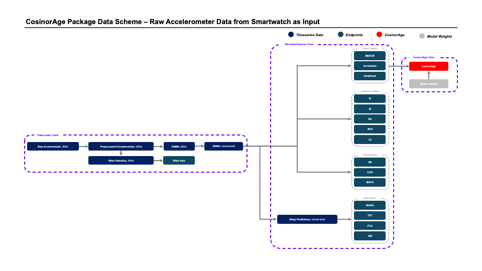

<div style="display: flex; align-items: center;">
    
    <h1 style="margin-right: 10px;">CosinorAge</h1>
</div>

[](https://cosinorage.readthedocs.io/en/latest/?badge=latest)
[](https://pypi.org/project/cosinorage/)

A Python package that calculates **CosinorAge**.

## Environment

## Installation

Clone the repository and install the package with:

```bash
git clone https://github.com/yourusername/cosinorage.git
cd cosinorage
pip install .
```

## Package Functionalities

### Data Loading

`DataLoader` object can be used to load raw smartwatch accelerometer data from a directory containing hourly csv
files.

```python
smartwatch_loader = DataLoader(datasource='smartwatch', input_path='../data/62164/', preprocess=True)
```

Moreover you can load minute-level ENMO data provided by the UK-Biobank from a csv file.

```python
biobank_loader = DataLoader(datasource='uk-biobank', input_path='../data/62164_ENMO.csv', preprocess=True)
```

The `load_data()` method reads the data from the input directory/file and calculates minute-level ENMO values (if not
already available) and stores it in a pandas DataFrame.

```python
smartwatch_loader.load_data()
```

The `save_data()` method saves the minute-level data to a csv file.

```python
smartwatch_loader.save_data(output_file_path='../data/62164_ENMO.csv')
```

### Wearable Feature Computation

The `WearableFeatures` object can be used to compute various features from the minute-level ENMO data.

```python
features = WearableFeatures(smartwatch_loader)
features.run()
```

### CosinorAge Computation

```python
cosinor_age = CosinorAge(features)
cosinor_age.fit()
cosinor_age.predict()
```

## Execute Tests

Go to the root directory of the repository and execute the following command to run the tests:

```bash
pytest
```

## Deploy Package

Build the package:
```bash
pip install build
python -m build
```

Upload the package to the PyPI repository:

```bash
pip install twine
twine upload dist/*
```


## Package Data Scheme 


