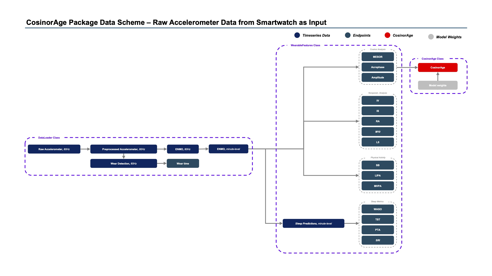

<div style="display: flex; align-items: center;">
    
    <h1 style="margin-right: 10px;">CosinorAge</h1>
</div>

[](https://cosinorage.readthedocs.io/en/latest/?badge=latest)
[](https://pypi.org/project/cosinorage/)

A Python package that calculates **CosinorAge**.

## Environment

## Installation

Clone the repository and install the package with:

```bash
git clone https://github.com/yourusername/cosinorage.git
cd cosinorage
pip install .
```

## Package Functionalities

### Data Loading

```python
galaxy_loader = GalaxyDataHandler(gw_file_dir='../data/smartwatch/GalaxyWatch_Case1/', preprocess=True, preprocess_args=preprocess_args, verbose=True)
```

```python
nhanes_loader = NHANESDataHandler(nhanes_file_dir='../data/nhanes/', person_id=62164, verbose=True)
```

```python
ukb_loader = UKBDataHandler(qa_file_path=qa_file_path, ukb_file_dir=enmo_file_dir, eid=eid, verbose=True)
```

### Wearable Feature Computation

The `WearableFeatures` object can be used to compute various features from the minute-level ENMO data.

```python
features = WearableFeatures(smartwatch_loader)
features.run()
```

## Execute Tests

Go to the root directory of the repository and execute the following command to run the tests:

```bash
pytest
```

## Deploy Package

Build the package:
```bash
pip install build
python -m build
```

Upload the package to the PyPI repository:

```bash
pip install twine
twine upload dist/*
```


## Package Data Scheme 


