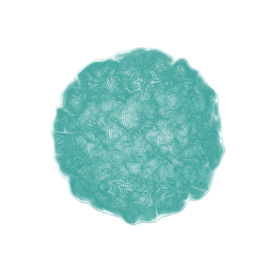
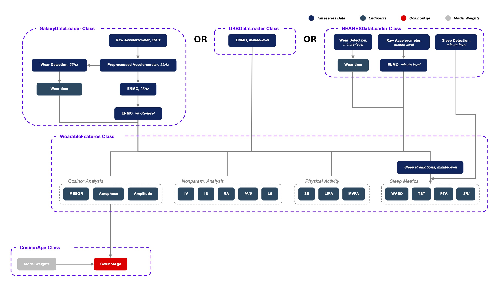

<div style="display: flex; align-items: center;">
    
    <h1 style="margin-right: 10px;">CosinorAge</h1>
</div>

[](https://cosinorage.readthedocs.io/en/latest/?badge=latest)
[](https://pypi.org/project/cosinorage/)

An open-source Python package for estimating biological age based on circadian rhythms derived from accelerometer data. The package offers a unified framework that integrates data preprocessing, feature extraction, and predictive modeling of biological age using the CosinorAge biomarker.

## Installation

```bash
pip install cosinorage
```

## Package Functionalities

For a detailed example of how to use the package, please refer to the examples in the [examples](examples) folder.

### Modular Scheme 



### Data Loading

Depending on the data source, we need to use different data handlers which implement the necessary preprocessing and data conversion steps. The datahandlers ensure that the data is available as minute-level ENMO data.

```python
galaxy_handler = GalaxyDataHandler(gw_file_dir='../data/smartwatch/GalaxyWatch_Case1/', preprocess=True, preprocess_args=preprocess_args, verbose=True)
```

```python
nhanes_handler = NHANESDataHandler(nhanes_file_dir='../data/nhanes/', person_id=62164, verbose=True)
```

```python
ukb_handler = UKBDataHandler(qa_file_path='../data/ukb/UKB Acc Quality Control.csv', ukb_file_dir='../data/ukb/UKB Sample Data/1_raw5sec_long', eid=1000300, verbose=True)
```

### Wearable Feature Computation

The `WearableFeatures` object can be used to compute various features from the minute-level ENMO data.

```python
features = WearableFeatures(smartwatch_handler)
features.run()
```

### CosinorAge Prediction

The `CosinorAge` object can be used to compute CosinorAge. It is capable of processing multiple datahandlers at the same time.

```python
records = [
    {'handler': data_handler, 
     'age': 40, 
     'gender': 'male'
    }
]

cosinor_age = CosinorAge(records)
cosinor_age.get_predictions()
```

## Open Source Development

The package is developed in an open-source manner. We welcome contributions to the package. 

### Clone the Repository

Clone the repository and install the package with:

```bash
git clone https://github.com/yourusername/cosinorage.git
cd cosinorage
pip install .
```

### Improve the Package

Any kind of contribution is welcome! In order to make new data sources compatible with the package, you can implement a new datahandler class - the package offers a DataHandler class that should be used as a base class.

### Implement and Execute Tests

To make sure that the changes you made are not breaking the package, you should implement new and execute the new and old tests. To do so, go to the root directory of the repository and execute the following command to run the tests:

```bash
pytest
```

Upon push to github, the tests will be executed automatically by the CI/CD pipeline and the commit will only be accepted if all the tests pass.

### Deploy Package

Build the package:
```bash
pip install build
python -m build
```

Upload the package to the PyPI repository:

```bash
pip install twine
twine upload dist/*
```

