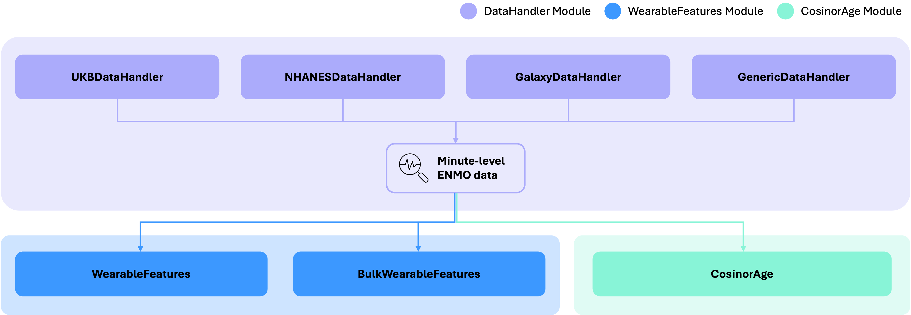
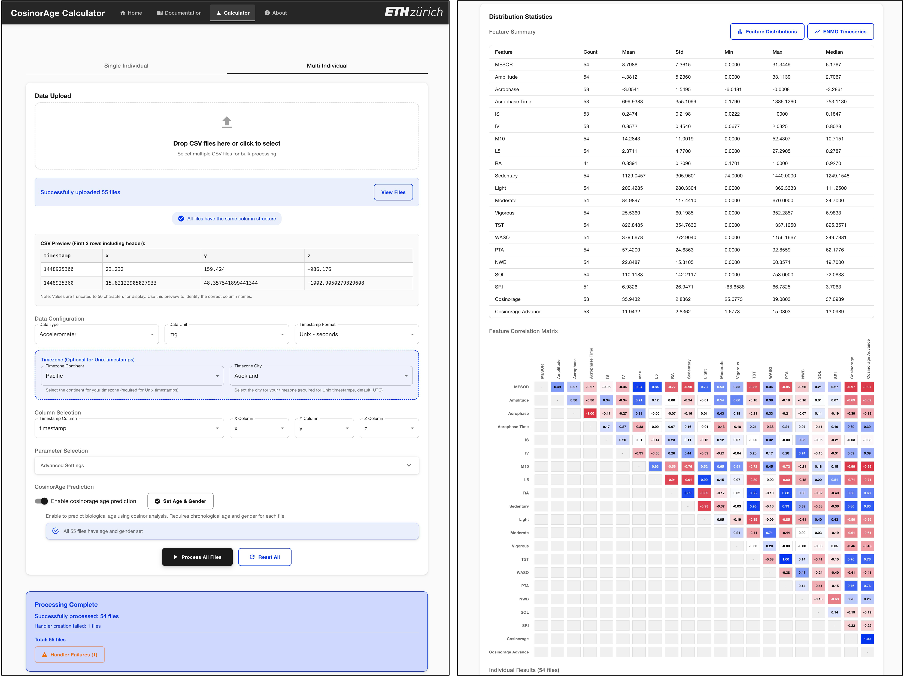

# Summary

Every day, millions of people track their steps, sleep, and circadian rest-activity rhythms using smartwatches and fitness trackers. These continuous data streams offer an opportunity to transform routine self-tracking into meaningful health insights that inform biological aging. However, most wearable data tools remain fragmented, proprietary, and inaccessible, limiting translation into actionable knowledge.

`CosinorAge` is an open-source Python package that estimates biological age from wearable-derived circadian, physical activity, and sleep metrics. Biological age reflects how old the body appears physiologically and can differ from chronological (calendar) age; it is commonly estimated from blood-based measures such as epigenetic clocks, whereas CosinorAge uses continuous accelerometer data to capture circadian rest-activity rhythms—a dimension not captured by one-off clinical samples [@shim2024circadian]. The package provides a unified, reproducible workflow for data preprocessing, feature computation, and biological age estimation, with pre-trained model parameters from large-scale cohorts such as UK Biobank. Its companion `CosinorAge Calculator` web application offers identical functionality without installation. Together, they enable transparent, scalable, and personalized health monitoring while bridging digital health and biological aging research.

# Statement of Need

Circadian rhythms play a critical role in maintaining key regulatory systems, including metabolic, immune, and endocrine pathways, and tightly govern circadian rest-activity cycles—the 24-hour alternation of movement and stillness measured by wrist-worn accelerometry, where rest largely corresponds to sleep but is inferred from low movement rather than polysomnography—encompassing sleep and physical activity (movement intensity during active periods), both essential to healthy aging. Disruptions in these daily rhythms, such as reduced amplitude, irregular activity timing, low activity levels, or poor sleep regularity, have been consistently linked to increased risk of chronic diseases, mortality, systemic inflammation, and accelerated biological aging [@shim2024circadian; @shim2025wrist]. Given these associations, there is an urgent need for continuous high-resolution monitoring of circadian rest-activity rhythms to characterize individualized rhythmicity and guide timely targeted interventions to optimize healthspan.

Wearable devices and smartwatches enable a scalable, non-invasive, and cost-efficient method for deriving digital biomarkers of circadian rhythms, physical activity, and sleep at both individual and population levels. However, most analytic tools focus on isolated metrics or rely on proprietary algorithms, limiting transparency, reproducibility, and their linkage to health outcomes such as biological age. To address this gap, we developed `CosinorAge` [@shim2024circadian], a digital biomarker package that estimates biological age and healthspan from circadian rest-activity rhythms using wearable data.

# State of the Field

Existing software packages for wearable-derived activity analysis typically focus on specific methodological components rather than providing an end-to-end framework that links circadian rest-activity rhythms across behavioral domains—circadian rhythm, physical activity, and sleep—to clinically interpretable aging outcomes. Tools such as pyActigraphy [@hammad2021pyactigraphy], actipy [@actipy], CosinorPy [@movskon2020cosinorpy], and scikit-digital-health [@adamowicz2022scikit] analyze specific domains of wearable data, while GGIR [@ggir] lacks a native Python implementation and functionality to link derived metrics to health-related outcomes.

`CosinorAge` was developed to address these limitations by integrating circadian rhythm analysis, physical activity, and sleep metrics across these three behavioral domains into a single, reproducible pipeline that directly estimates biological age. Extending existing tools was insufficient to support harmonized preprocessing across heterogeneous devices, joint modeling across behavioral domains, and the application of openly available biological age model coefficients [@shim2024circadian]. As a result, a new package was required to enable consistent, transparent application across cohorts and study contexts.

# Software Design

`CosinorAge` was designed as a modular package that balances flexibility, reproducibility, and accessibility across heterogeneous accelerometer data sources. Supported inputs include research-grade actigraphy (NHANES, UK Biobank), consumer smartwatch recordings (Samsung Galaxy Watch), and user-supplied CSV files (bring-your-own-data). Data may be provided as raw triaxial accelerometer readings or pre-computed minute-level ENMO time series; the DataHandler module harmonizes these into a standardized format before feature extraction and modeling. Core analytical logic is implemented in a reusable Python package and exposed through a web interface with identical functionality, enabling both rigorous research workflows and no-code usage without diverging outcomes.

## CosinorAge Python Package

The **CosinorAge Python package** is structured into three core modules, each representing a key stage in the workflow for analyzing accelerometer data and predicting the CosinorAge biological age estimate. Its modular architecture allows components to be used independently or integrated into a streamlined workflow. Figure 2 illustrates the modular design and high-level data flow between components.

### DataHandler Module
The package provides four DataHandler subclasses to support accelerometer data from multiple sources: UK Biobank (UKB), NHANES (National Health and Nutrition Examination Survey), Samsung Galaxy smartwatches (Galaxy), and bring-your-own-data (BYOD). UKBDataHandler, NHANESDataHandler, and GalaxyDataHandler perform source-specific filtering, preprocessing, and scaling to produce standardized, minute-level ENMO (Euclidean Norm Minus One, a standard accelerometer-derived activity intensity metric) time series. Detailed data preprocessing for each DataHandler can be found on GitHub. For greater flexibility, a GenericDataHandler is also provided, allowing users to process any compatible CSV file formatted according to a defined specification through a BYOD approach. The resulting ENMO data can then be passed to the feature extraction and modeling modules for downstream analysis.

### WearableFeatures Module
The WearableFeatures module includes two classes: WearableFeatures and BulkWearableFeatures. Designed for individual-level analysis, the WearableFeatures class computes a comprehensive set of metrics from minute-level ENMO data, covering physical activity, sleep behavior, and both parametric and non-parametric circadian rhythm features. For cohort-level studies, the BulkWearableFeatures class supports batch processing of multiple individuals, enabling users to analyze feature distributions and explore inter-feature correlations across the population. The list of features computed from this module, organized by behavioral domain, is summarized below:

| **Domain** | **Metrics** |
|------------|-------------|
| Circadian Rhythm Analysis | MESOR (Midline Estimating Statistic of Rhythm; rhythm-adjusted mean activity level), cosinor amplitude, acrophase, M10, L5, interdaily stability (IS), intradaily variability (IV), relative amplitude (RA) |
| Physical Activity Analysis | Light physical activity (LPA), Moderate physical activity (MPA), vigorous physical activity (VPA), sedentary duration |
| Sleep Analysis | Total sleep time (TST), wake after sleep onset (WASO), percent time asleep (PTA), number of waking bouts (NWB), sleep onset latency (SOL) |

### CosinorAge Module
The CosinorAge module represents the final stage of the workflow and contains a single class that estimates biological age (in years) from minute-level ENMO data using a pre-trained proportional hazards model [@shim2024circadian]. The output can also be expressed as age advance (predicted biological age minus chronological age), where positive values indicate accelerated biological aging. We refer to CosinorAge as a digital biomarker of aging because it is derived from wearable data and associated with mortality risk in the training cohort. The model supports three pre-trained coefficient sets: a sex-combined (generic) model used when sex is unknown, a female-specific model, and a male-specific model. If available, sex can be supplied as an optional input to select the sex-stratified coefficients and improve prediction accuracy. The underlying coefficients were estimated from large-scale cohorts such as UK Biobank [@shim2024circadian] and are openly available in the package source code. This open-weight design enables researchers to apply the same model across diverse datasets with clear and accessible parameters, thereby facilitating reproducibility and offering a transparent alternative to proprietary algorithms.

## CosinorAge Calculator: Web User Interface

To enhance the accessibility of the **CosinorAge Python package**, we developed a Web interface that allows researchers and users to analyze their own data without requiring any installation or programming expertise (www.cosinorage.app). Users can simply upload their data, which is processed by the **CosinorAge package** in the backend. Results are presented in a clear, report-style format that includes visualizations to aid interpretation. A multi-user mode is also available, enabling researchers to upload and analyze data from multiple individuals simultaneously, allowing for the exploration of feature distributions and correlations across cohorts.

The Web interface is organized into several sections:

- The Home tab provides an overview of the `CosinorAge` package, its purpose, key features, and demo video.  
- The Documentation tab offers comprehensive API and interface documentation.  
- The Calculator tab hosts the core analysis workspace with interactive tools for uploading wearable data, running circadian rest-activity rhythm analyses and biological age estimation, and viewing results in real time.  
- The About tab presents information about the research group and contributing members.  

The Calculator tab offers a user-friendly interface, as illustrated in Figure 3. **CosinorAge Calculator** supports BYOD via batch CSV uploads from either single or multiple individuals, with automatic file structure preview for validation (subject to file size limits). Users can configure device type, timestamp format, time zone, and select parameters for analysis. When multi-individual mode is selected, the summary dashboard presents descriptive statistics for all extracted features, a feature correlation matrix, and visual summaries of each metric at the population level.

# Research Impact Statement

`CosinorAge` operationalizes prior peer-reviewed work demonstrating that circadian rest-activity rhythms are strongly associated with mortality risk and biological aging [@shim2024circadian; @shim2025wrist]. By releasing openly available model coefficients derived from large-scale population datasets such as UK Biobank, the package enables reproducible biological age estimation without retraining and supports comparability across independent cohorts.

The software supports research-grade actigraphy, large epidemiological datasets (e.g., UK Biobank and NHANES), and consumer smartwatch data, facilitating cross-device and cross-study analyses. Recent validation work has demonstrated comparability between research-grade accelerometers and consumer smartwatches for circadian rhythm assessment [@wu2025comp], highlighting the translational potential of the platform. By combining open-source implementation, standardized preprocessing, and biological age estimation, `CosinorAge` provides a reusable research tool for studying aging trajectories, intervention effects, and digital biomarkers across diverse populations.

# AI Usage Disclosure

Generative AI tools were used in a limited capacity to support code development and language editing during manuscript preparation. All software, analyses, and text were critically reviewed, validated, and finalized by the authors.

# References
