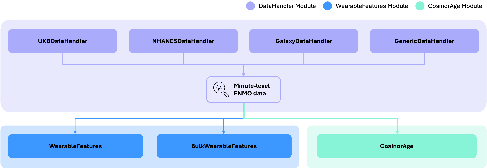
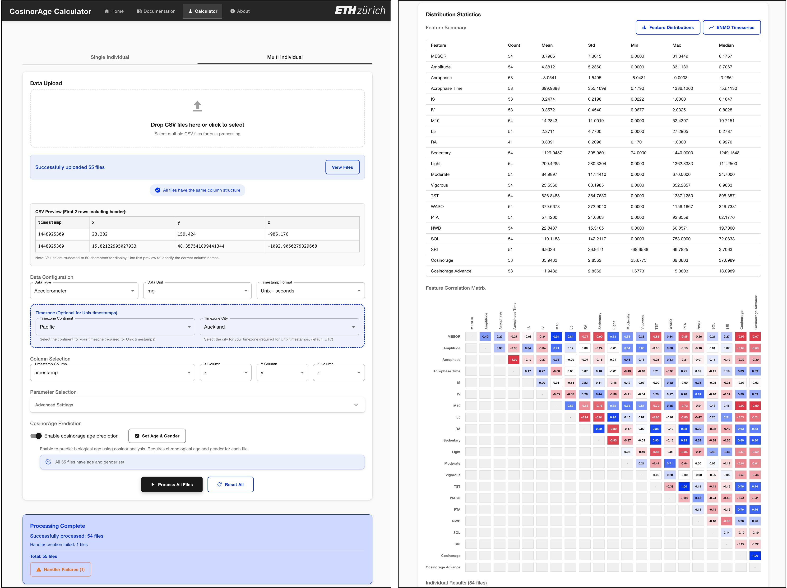

# Summary

Every day, millions of people track their steps, sleep, and activity rhythms using smartwatches and fitness trackers. These continuous data streams offer an opportunity to transform routine self-tracking into meaningful health insights that inform biological aging. However, most wearable data tools remain fragmented, proprietary, and inaccessible, limiting translation into actionable knowledge.

`CosinorAge` is an open-source framework that estimates biological age from wearable-derived circadian, physical activity, and sleep metrics. It provides a unified, reproducible Python pipeline for data preprocessing, feature computation, and biological age estimation, with trained model parameters from large-scale datasets such as the UK Biobank. Its companion `CosinorAge Calculator` offers identical functionality via a web interface. Together, they enable transparent, scalable, and personalized health monitoring while bridging digital health and biological aging research..

# Statement of Need

Circadian rhythms play a critical role in maintaining key regulatory systems, including metabolic, immune, and endocrine pathways, and tightly govern rest–activity cycles encompassing sleep and physical activity, both essential to healthy aging. Disruptions in these daily rhythms, such as reduced amplitude, irregular activity timing, low activity levels, or poor sleep regularity, have been consistently linked to increased risk of chronic diseases, mortality, systemic inflammation, and accelerated biological aging [@shim2024circadian; @shim2025wrist]. Given these associations, there is an urgent need for continuous high-resolution monitoring of daily rest-activity patterns to characterize individualized rhythmicity and guide timely targeted interventions to optimize healthspan.

Wearable devices and smartwatches enable a scalable, non-invasive, and cost-efficient method for digital biomarkers of circadian rhythms, physical activity, and sleep at both individual and population levels. However, most analytic tools focus on isolated metrics or rely on proprietary algorithms, limiting transparency, reproducibility, and their linkage to health outcomes such as biological age. To address this gap, we developed `CosinorAge` [@shim2024circadian], a digital biomarker framework that estimates biological age and healthspan from circadian rest-activity rhythms using wearables.

`CosinorAge` provides a unified, open-source analytic pipeline for processing raw wearable data—from ingestion and preprocessing to feature computation and biological age estimation. While existing tools such as pyActigraphy [@hammad2021pyactigraphy], actipy [@actipy], CosinorPy [@movskon2020cosinorpy], and scikit-digital-health [@adamowicz2022scikit] analyze analyzing specific domains, and GGIR [@ggir] lacks functionalities that link metrics to health outcomes and Python implemention, `CosinorAge` integrates circadian, activity, and sleep domains into a single reproducible framework. Importantly, `CosinorAge` represents a digital *second-order clock* derived from mortality risk rather than chronological age, capturing healthspan-relevant processes with higher precision [@shim2024circadian].

The workflow supports input from research-grade actigrpahy, large-scale datasets (e.g., UK Biobank and NHANES), and consumer wearables (e.g., Samsung Galaxy Watch), demonstrating broad compatibility across hardware platforms. Recent work has further validated the comparability between research-grade actigraphy and consumer-centric smartwatches in assessing circadian rhythms, underscoring the potential of `CosinorAge` to integrate data across different device types and study contexts [@wu2025comp].  

`CosinorAge` is designed for scalability and accessibility. It is available as the **CosinorAge Python Package** and **CosinorAge Calculator**, a web-based interface offering identical analytical capabilities. The Calculator allows non-technical users to estimate biological age directly from their own wearable data, democratizing health analytics and enabling personalized monitoring of aging and resilience. Beyond individual use, these tools provide a unified, open framework that extends methodologies across circadian rhythm, aging, and digital health research, promoting cross-disciplinary collaboration and enhancing reproducibility and accessibility.

A key aspect of `CosinorAge` is the release of the model coefficients derived from large-scale population datasets such as UK Biobank. Making these open weights available allows biological age estimation without retraining and facilitates comparability across new cohorts. This design provides a transparent alternative to proprietary algorithms and increases the translational utility of the package in both research and applied contexts.

The `CosinorAge` tools are applicable to studies where wearable-derived behavioral rhythms are central to the research question. They can be used to quantify circadian, activity, and sleep patterns in terms of strength, timing, and stability, and estimate biological age to examine associations with aging trajectories, intervention effects, and health outcomes. The tools process data from single individuals and multi-participant cohorts alike, providing both individual-level metrics and cohort-level summaries that can be linked to broader research on aging and health.

# How it Works

## CosinorAge Python Package.

The **CosinorAge Python package** is structured into three core modules, each representing a key stage in the pipeline for analyzing accelerometer data and predicting biological age, `CosinorAge`. Its modular architecture allows components to be used independently or integrated into a streamlined workflow. Figure 2 illustrates the modular design and high-level data flow between components.

### DataHandler Module
The package provides a total of four DataHandler subclasses to support accelerometer data from multiple sources including UK Biobank (UKB), NHANES, Samsung Galaxy Smartwatches (Galaxy), and Bring-Your-Own-Data (BYOD). UKBDataHandler, NHANESDataHandler, and GalaxyDataHandler perform source-specific filtering, preprocessing, and scaling to produce standardized, minute-level ENMO time series. Detailed data pre-processing for each DataHandler can be found on GitHub. For greater flexibility, a GenericDataHandler is also provided, allowing users to process any compatible CSV file formatted according to a defined specification through BYOD approach. The resulting ENMO data can then be passed to the feature extraction and modeling modules for downstream analysis.

### WearableFeatures Module
The WearableFeatures module includes two classes: WearableFeatures and BulkWearableFeatures. Designed for individual-level analysis, the WearableFeatures class computes a comprehensive set of metrics from minute-level ENMO data, covering physical activity, sleep behavior, and both parametric and non-parametric circadian rhythm features. For cohort-level studies, the BulkWearableFeatures class supports batch processing of multiple individuals, enabling users to analyze feature distributions and explore inter-feature correlations across the population. The list of features computed from this module is summarized below: 

| **Domain** | **Metrics** |
|------------|-------------|
| Circadian Rhythm Analysis | MESOR, cosinor amplitude, acrophase, M10, L5, interdaily stability (IS), intradaily variability (IV), relative amplitude (RA) |
| Physical Activity Analysis | Light physical activity (LPA), Moderate physical activity (MPA),vigorous physical activity (VPA), sedentary duration |
| Sleep Analysis | Total sleep time (TST), wake after sleep onset (WASO), percent time asleep (PTA), number of waking bouts (NWB), sleep onset latency (SOL) |

### CosinorAge Module
The `CosinorAge` module represents the final stage of the pipeline and contains a single class responsible for predicting the `CosinorAge` biomarker. It takes minute-level ENMO data as input and applies a pre-trained proportional hazards model to estimate biological age [@shim2024circadian]. The model supports three sets of coefficients - unisex, female-specific, and male-specific. If available, sex can be included as an optional input to improve prediction accuracy. The underlying model coefficients were estimated from large-scale cohorts such as UK Biobank and are openly available. This open-weight design enables researchers to apply the same model across diverse datasets with clear and accessible parameters, thereby facilitating reproducibility and offering a transparent alternative to proprietary algorithms.

## CosinorAge Calculator: Web User Interface.

To enhance the accessibility of the **CosinorAge Python package**, we developed a web-based interface that allows researchers and users to analyze their own data without requiring any installation or programming expertise (www.cosinorage.app). Users can simply upload their data, which is processed by the **CosinorAge package** in the backend. Results are presented in a clear, report-style format that includes visualizations to aid interpretation. A multi-user mode is also available, enabling researchers to upload and analyze data from multiple individuals simultaneously, allowing for the exploration of feature distributions and correlations across cohorts.

The Web Interface is organized into several sections:

- The Home tab provides an overview of the `CosinorAge` framework, its purpose, key features, and demo video.  
- The Documentation tab offers comprehensive API and interface documentation.  
- The Calculator tab hosts the core analysis workspace with interactive tools for uploading wearable data, running activity rhythm analyses and biological age estimation, and viewing results in real time.  
- The About tab presents information about the research group and contributing members.  

The Calculator tab offers a user-friendly interface, as illustrated in Figure 3. **CosinorAge Calculator** supports BYOD via batch CSV uploads from either single or multiple individuals, with automatic file structure preview for validation (subject to file size limits). Users can configure device type, timestamp format, time zone, and select parameters for analysis. When multi-individual mode is selected, the summary dashboard presents descriptive statistics for all extracted features, a feature correlation matrix, and visual summaries of each metric at the population level.

# References
